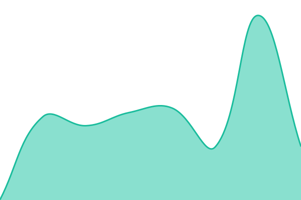
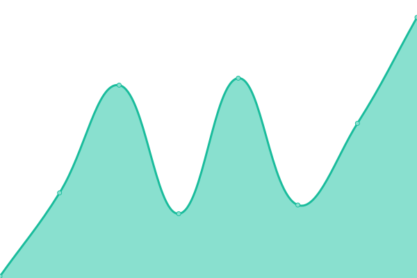
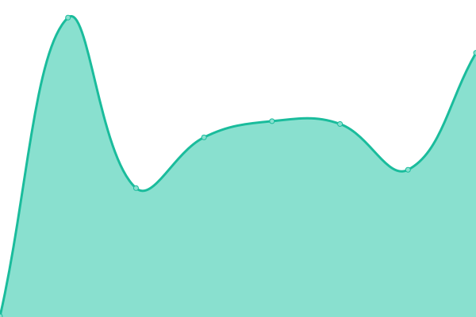
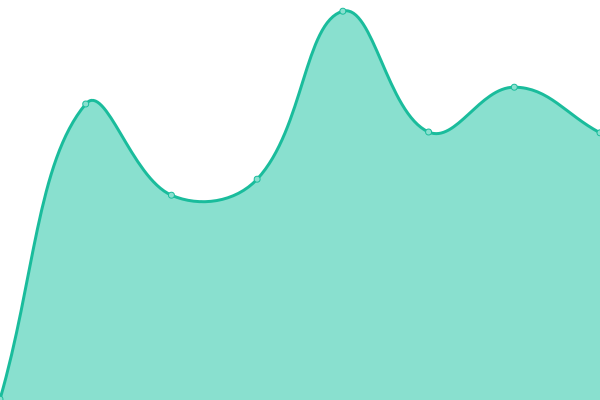
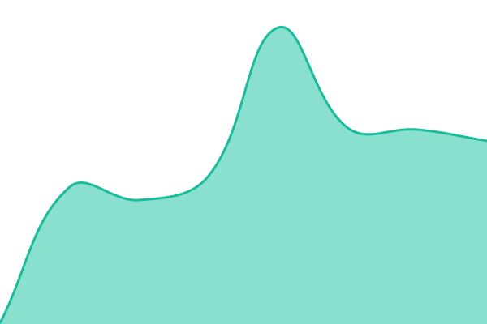

# [📈 Live Status](https://bids-standard.github.io/uptime): <!--live status--> **🟩 All systems operational**

This repository contains the open-source uptime monitor and status page for [Brain Imaging Data Structure](https://bids.neuroimaging.io), powered by [Upptime](https://github.com/upptime/upptime).

With [Upptime](https://upptime.js.org), you can get your own unlimited and free uptime monitor and status page, powered entirely by a GitHub repository. We use [Issues](https://github.com/bids-standard/uptime/issues) as incident reports, [Actions](https://github.com/bids-standard/uptime/actions) as uptime monitors, and [Pages](https://bids-standard.github.io/uptime) for the status page.

<!--start: status pages-->
<!-- This summary is generated by Upptime (https://github.com/upptime/upptime) -->
<!-- Do not edit this manually, your changes will be overwritten -->
<!-- prettier-ignore -->
| URL | Status | History | Response Time | Uptime |
| --- | ------ | ------- | ------------- | ------ |
|  [Specification](https://bids-specification.readthedocs.io/) | 🟩 Up | [specification.yml](https://github.com/bids-standard/uptime/commits/HEAD/history/specification.yml) | 

 254ms
     
 | 

<a href="https://bids-standard.github.io/uptime/history/specification">100.00%</a>
    

|  [Website](https://bids.neuroimaging.io/) | 🟩 Up | [website.yml](https://github.com/bids-standard/uptime/commits/HEAD/history/website.yml) | 

 230ms
     
 | 

<a href="https://bids-standard.github.io/uptime/history/website">100.00%</a>
    

|  [Validator](https://bids-standard.github.io/bids-validator/) | 🟩 Up | [validator.yml](https://github.com/bids-standard/uptime/commits/HEAD/history/validator.yml) | 

 112ms
     
 | 

<a href="https://bids-standard.github.io/uptime/history/validator">100.00%</a>
    

|  [Validator Documentation](https://bids-validator.readthedocs.io/) | 🟩 Up | [validator-documentation.yml](https://github.com/bids-standard/uptime/commits/HEAD/history/validator-documentation.yml) | 

 287ms
     
 | 

<a href="https://bids-standard.github.io/uptime/history/validator-documentation">100.00%</a>
    

|  [Validator (development)](https://bids-standard.github.io/bids-validator/dev/) | 🟩 Up | [validator-development.yml](https://github.com/bids-standard/uptime/commits/HEAD/history/validator-development.yml) | 

 51ms
     
 | 

<a href="https://bids-standard.github.io/uptime/history/validator-development">100.00%</a>
    

|  [Validator (legacy)](https://bids-standard.github.io/legacy-validator/) | 🟩 Up | [validator-legacy.yml](https://github.com/bids-standard/uptime/commits/HEAD/history/validator-legacy.yml) | 

 57ms
     
 | 

<a href="https://bids-standard.github.io/uptime/history/validator-legacy">100.00%</a>
    

|  [BIDS Stats Models](https://bids-standard.github.io/stats-models/) | 🟩 Up | [bids-stats-models.yml](https://github.com/bids-standard/uptime/commits/HEAD/history/bids-stats-models.yml) | 

 65ms
     
 | 

<a href="https://bids-standard.github.io/uptime/history/bids-stats-models">100.00%</a>
    

|  [BIDS Stats Models Zoo](https://bids-standard.github.io/model-zoo/) | 🟩 Up | [bids-stats-models-zoo.yml](https://github.com/bids-standard/uptime/commits/HEAD/history/bids-stats-models-zoo.yml) | 

 51ms
     
 | 

<a href="https://bids-standard.github.io/uptime/history/bids-stats-models-zoo">100.00%</a>
    

|  [Awesome BIDS](https://bids-standard.github.io/awesome-bids/) | 🟩 Up | [awesome-bids.yml](https://github.com/bids-standard/uptime/commits/HEAD/history/awesome-bids.yml) | 

 87ms
     
 | 

<a href="https://bids-standard.github.io/uptime/history/awesome-bids">100.00%</a>
    

|  [BIDS schema tools documentation](https://bidsschematools.readthedocs.io/) | 🟩 Up | [bids-schema-tools-documentation.yml](https://github.com/bids-standard/uptime/commits/HEAD/history/bids-schema-tools-documentation.yml) | 

 258ms
     
 | 

<a href="https://bids-standard.github.io/uptime/history/bids-schema-tools-documentation">100.00%</a>
    

|  [PyBIDS Documentation](https://bids-standard.github.io/pybids/) | 🟩 Up | [py-bids-documentation.yml](https://github.com/bids-standard/uptime/commits/HEAD/history/py-bids-documentation.yml) | 

 59ms
     
 | 

<a href="https://bids-standard.github.io/uptime/history/py-bids-documentation">100.00%</a>
    

|  [PyBIDS-reports Documentation](https://pybids-reports.readthedocs.io/) | 🟩 Up | [py-bids-reports-documentation.yml](https://github.com/bids-standard/uptime/commits/HEAD/history/py-bids-reports-documentation.yml) | 

 288ms
     
 | 

<a href="https://bids-standard.github.io/uptime/history/py-bids-reports-documentation">100.00%</a>
    

|  [Pybv Documentation](https://pybv.readthedocs.io/) | 🟩 Up | [pybv-documentation.yml](https://github.com/bids-standard/uptime/commits/HEAD/history/pybv-documentation.yml) | 

 283ms
     
 | 

<a href="https://bids-standard.github.io/uptime/history/pybv-documentation">100.00%</a>
    

|  [bids-matlab Documentation](https://bids-matlab.readthedocs.io/) | 🟩 Up | [bids-matlab-documentation.yml](https://github.com/bids-standard/uptime/commits/HEAD/history/bids-matlab-documentation.yml) | 

 298ms
     
 | 

<a href="https://bids-standard.github.io/uptime/history/bids-matlab-documentation">100.00%</a>
    

|  [BIDS Apps](https://bids-apps.neuroimaging.io/) | 🟩 Up | [bids-apps.yml](https://github.com/bids-standard/uptime/commits/HEAD/history/bids-apps.yml) | 

 202ms
     
 | 

<a href="https://bids-standard.github.io/uptime/history/bids-apps">100.00%</a>
    

|  [BIDS Execution Specification](https://bids-standard.github.io/execution-spec/) | 🟩 Up | [bids-execution-specification.yml](https://github.com/bids-standard/uptime/commits/HEAD/history/bids-execution-specification.yml) | 

 97ms
     
 | 

<a href="https://bids-standard.github.io/uptime/history/bids-execution-specification">100.00%</a>
    

<!--end: status pages-->

[**Visit our status website →**](https://bids-standard.github.io/uptime)

## 📄 License

- Powered by: [Upptime](https://github.com/upptime/upptime)
- Code: [MIT](./LICENSE) © [Anand Chowdhary](https://anandchowdhary.com), supported by [Pabio](https://pabio.com)
- Data in the `./history` directory: [Open Database License](https://opendatacommons.org/licenses/odbl/1-0/)
